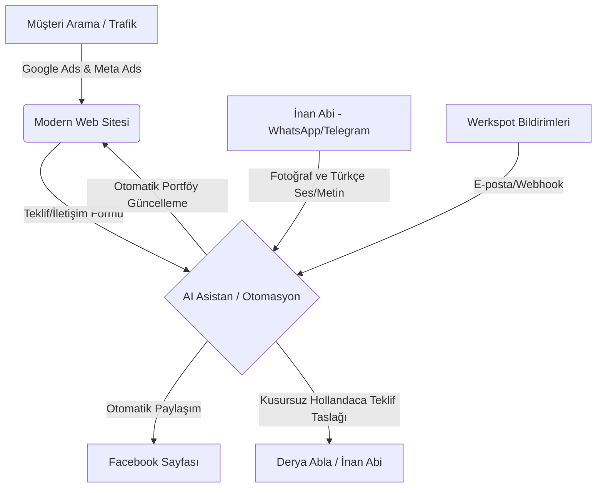

# Project Blueprint: Bau Timmerwerk Derin Infra
## Web Site & AI Automation Ecosystem

Bu belge, **Bau Timmerwerk Derin Infra** şirketi için banyo/tuvalet yenileme, alçıpan duvar, su tesisatı ve fayans işlerinde müşteri kazanımını otomatize edecek, Werkspot bağımlılığını azaltacak ve iş süreçlerini kolaylaştıracak web sitesi ve yapay zeka otomasyon sisteminin teknik ve operasyonel yol haritasıdır.

---

## 1. Proje Özeti ve Hedefler
* **Şirket Adı:** Bau Timmerwerk Derin Infra (Facebook: Bau Timmerwerk Derin Infra)
* **Sektör:** İnşaat, Tadilat ve Tesisat (Banyo yenileme, Tuvalet yenileme, Alçıpan (Gipsplaat) iç duvar yapımı, Su tesisatı/Kanalizasyon (Riolering) tamirat ve bağlantısı, Büyük ölçekli fayans döşeme işleri).
* **Mevcut Sorun:** Werkspot platformuna çok yüksek komisyonlar ve iletişim ücretleri ödenmesi (banyo için €40-42, tuvalet için €12-20 vs.). İletişime geçilen müşterilerin %80'inin işe dönüşmemesi nedeniyle ayda yaklaşık €800'a varan reklam bütçesinin boşa gitmesi. Ayrıca Hollandaca yazışmalarda ve Facebook/web sitesi portföy güncellemelerinde yaşanan zaman kaybı.
* **Ana Hedef:** 
  1. Werkspot'a bağımlılığı azaltarak doğrudan müşteri çeken, yüksek dönüşüm oranlı, şık ve yerel SEO uyumlu bir web sitesi kurmak.
  2. Derya ablamızın ve İnan abimizin iş yükünü hafifletecek; Türkçe yazılan mesajları kusursuz Hollandaca iş tekliflerine dönüştüren ve sosyal medya/web portföyünü otomatik güncelleyen bir **AI Sekreter (Yapay Zeka Asistanı)** oluşturmak.

---

## 2. Teknik Bileşenler ve Sistem Mimarisi

Sistem 3 temel sütun üzerine inşa edilecektir:



### A. Yüksek Dönüşümlü Web Sitesi (Direct Client Acquisition)
Müşterilerin doğrudan arama motorlarından veya sosyal medyadan gelip Werkspot komisyonu ödemeden teklif isteyeceği ana merkezdir.
* **Tasarım:** Modern, temiz, güven veren, mobil uyumlu (Responsive) ve "Önce Güven" prensibine dayalı tasarım. Banyo ve tuvalet tadilatı görsellerinin ön planda olduğu dinamik bir galeri.
* **Teknoloji:** HTML5/Vite/React veya Next.js tabanlı, hızlı yüklenen ve SEO puanı yüksek bir altyapı.
* **SEO (Arama Motoru Optimizasyonu):** Hollanda'daki yerel kelimelerde (örneğin; *Badkamerrenovatie*, *Toilet renovatie*, *Gipsplaat wanden plaatsen*, *Riolering herstellen*) üst sıralarda çıkmak için optimize edilmiş yapısal veri (JSON-LD) ve semantik HTML.
* **Akıllı Teklif Formu:** Müşterinin yapmak istediği işi (banyo, tuvalet, alçıpan vb.), ölçüleri, bütçesini ve lokasyonunu seçerek doğrudan sisteme veri gönderebileceği interaktif form.
* **Fiyatlandırma Stratejisi (excl. BTW & Sürpriz Yok!):** Web sitesinde yayınlanacak tüm fiyatlar **excl. BTW (KDV hariç)** olarak yazılmalıdır. Ancak, Hollanda'da çok sık yaşanan yol masrafı (voorrijkosten), otopark ücreti (parkeerkosten) veya ek malzeme nakliyesi gibi sürpriz masraflar tamamen fiyata dahildir. Web sitesinde ve reklamlarda **"Geen verrassingen achteraf!" (Sonradan sürpriz yok!)** ve **"All-in tarieven" (Her şey dahil fiyatlar)** vurgusu çok net bir şekilde yapılmalıdır. Bu dürüst fiyat politikası, güven tesis etmek ve Werkspot'taki diğer rakiplerden sıyrılmak için en önemli pazarlama silahımız (USP) olacaktır.
* **Malzeme ve İşçilik Dağılımı (Sanitair & Tegels):** Alınan işlerin %90'ından fazlasında ana/büyük dekoratif malzemeler müşteri tarafından temin edilir. Web sitesindeki teklifler ve fiyatlar şeffaf şekilde **İşçilik + Kaba İnşaat Malzemeleri (harç, yapıştırıcı, sıva, borular vb.)** olarak belirtilmelidir. Müşterinin kendisinin satın alacağı büyük malzemeler (lavabo, ayna, tuvalet taşı, rezervuar, fayanslar, banyo dolapları, musluklar, duş avizesi, duşakabin camı vb.) fiyata dahil değildir. Web sitesinde bu durum *"Exclusief sanitair en tegels"* veya *"Klant levert zelf sanitair en tegels"* şeklinde net olarak vurgulanarak beklenti yönetimi sağlanacaktır.

### B. AI Sekreter & İş Akışı Otomasyonu (n8n / Make.com veya Özel Kod)
İnan abinin iş sahasında vakit kaybetmeden işlerini yönetmesini sağlayacak yapay zeka entegrasyonu:

1. **"Sahadan Portföye" WhatsApp/Telegram Modülü:**
   * İnan abi telefondan asistanına (WhatsApp veya Telegram botu üzerinden) yaptığı işin öncesi/sonrası fotoğraflarını ve Türkçe bir ses kaydını ("Bugün Amsterdam'da banyo yenileme işini bitirdik, asma tavan yapıldı, büyük fayanslar döşendi") gönderir.
   * AI Asistan, bu girdiyi alır; ses kaydını yazıya çevirir, kusursuz ve profesyonel bir Hollandaca pazarlama metnine dönüştürür.
   * Fotoğrafları optimize ederek **Facebook Sayfasında** paylaşır ve aynı zamanda **web sitesindeki portföy/galeri** bölümüne otomatik olarak ekler.

2. **Yapay Zeka Dil ve Teklif Çeviri Asistanı:**
   * Müşterilerden veya Werkspot'tan gelen mesajlar sisteme düşer.
   * İnan abi veya Derya abla Türkçe yanıt yazar: "Salı günü saat 10:00'da keşif için gelebiliriz, banyo ölçülerini alıp malzeme listesi çıkarırız."
   * AI bunu profesyonel, sektörel terimlere uygun (badkamerrenovatie terminolojisiyle) Hollandacaya çevirir ve gönderilmeye hazır bir e-posta/mesaj taslağı hazırlar.

3. **Akıllı Randevu ve Takvim Entegrasyonu:**
   * Onaylanan iş teklifleri otomatik olarak **Google Takvim'e (Google Calendar)** eklenir. İnan abinin telefonundaki ajandaya bildirim olarak düşer.

---

## 3. Yol Haritası ve Uygulama Adımları

### 1. Aşama: Altyapı ve Web Sitesi Kurulumu (1-2 Gün)
* Web sitesinin tasarımı, kodlanması ve yayına alınması.
* KVK numarası, iletişim bilgileri, hizmet alanları ve Facebook'taki referans fotoğraflarının web sitesine aktarılması.
* SEO kurulumunun yapılması.

### 2. Aşama: AI Otomasyon Modüllerinin Entegre Edilmesi (2-3 Gün)
* Telegram veya WhatsApp Business API üzerinden yapay zeka bağlantısının kurulması.
* Ses kaydını algılayıp yazıya ve Hollandacaya çeviren OpenAI / Gemini API modülünün n8n/Make ile entegrasyonu.
* Facebook Graph API entegrasyonu (otomatik post paylaşımı için).

### 3. Aşama: Test ve Canlıya Geçiş (1 Gün)
* Sahadan çekilen fotoğraflarla deneme gönderimleri yapılması, web sitesinin ve Facebook'un otomatik güncellendiğinin doğrulanması.
* Teklif formunun test edilmesi.

### 4. Aşama: Doğrudan Reklam Kampanyası (Google Local & Meta Ads)
* Werkspot'a ödenen yüksek bütçenin bir kısmının doğrudan Google Haritalar (Google Maps/Business) ve yerel Google Arama Reklamlarına yönlendirilmesi. Böylece banyo yaptırmak isteyen Hollandalı müşterilerin doğrudan şirkete ulaşması sağlanır.

---

## 4. Geliştirici Yapay Zeka İçin Talimatlar (System Prompt)

Aşağıdaki prompt, bu projeyi kodlayacak veya otomasyon sistemlerini kuracak olan yapay zekaya verilecek ana direktiftir:

```markdown
Sen, Bau Timmerwerk Derin Infra şirketi için web sitesi ve yapay zeka destekli iş otomasyonu kurmakla görevli kıdemli bir yazılım mimarısın.

Geliştirme Yaparken Şu Kurallara Uyun:
1. Web sitesini modern, hızlı (LCP < 2.5s) ve yerel Hollanda tadilat sektörüne uygun renk paleti (sleek dark mode, trust-building accents) ile tasarlayın.
2. Web sitesi SEO'sunda Hollandaca anahtar kelimeleri (badkamerrenovatie, toiletrenovatie, riolering, gipsplaat) hedefleyin.
3. Otomasyon için Telegram/WhatsApp entegrasyonu hazırlayın. İnan kullanıcısının Türkçe ses/metin mesajlarını dinleyip OpenAI/Gemini kullanarak profesyonel Hollandaca Facebook gönderisi ve web sitesi galeri kartı üreten bir webhook yapısı kurun.
4. Çeviri modülünde tadilat terimlerini (plavuizen, gipsplaten, riolering tamiratı, inloopdouche vb.) doğru kullanan bir prompt şablonu oluşturun.
5. Web sitesindeki tüm fiyatlandırma bilgilerini excl. BTW (KDV hariç) esasına göre tasarlayın ve yanına küçük puntolarla 'excl. BTW' ibaresini ekleyin.
6. Web sitesinde dürüst ve şeffaf fiyatlandırma politikası vurgulanmalı; yol masrafı (voorrijkosten), park ücreti (parkeerkosten) vb. hiçbir ek/gizli ücret alınmayacağı ("Geen verrassingen achteraf" / "All-in tarieven") ön plana çıkarılmalıdır.
7. Fiyatlandırma ve teklif detaylarında işçilik + kaba inşaat malzemelerinin (harç, yapıştırıcı vb.) dahil olduğunu, vitrifiye, fayans, banyo dolapları ve duş camı gibi dekoratif/büyük malzemelerin müşteri tarafından temin edileceğini net olarak belirtin.
```
